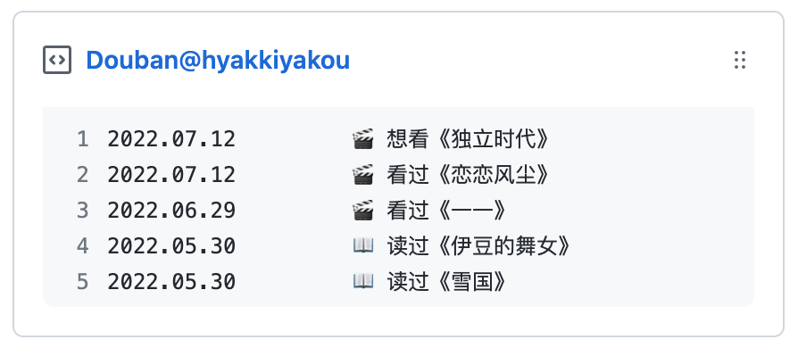

<p align = "center">
  
</p>
<h2 align = "center">Douban Box Go</h2>
<p align = "center">同步豆瓣的 RSS 订阅到 Gist </p>

--- 

> 📌✨ 更多像这样的 Pinned Gist 项目请访问：https://github.com/matchai/awesome-pinned-gists

## 准备工作

### 1. 创建 Gist 并获取 Gist ID

- 登录 Github 并打开个人 Gist 页面，比如我的是 `https://gist.github.com/NERVEbing`
- 点击右上角 ```+``` 号创建 Gist，任意输入内容并保存
- 记录 URL 中的 Gist ID，类似 `https://gist.github.com/NERVEbing/0381870420b9aa3c4b11f40468df38af`
  ，用户名后面的 `0381870420b9aa3c4b11f40468df38af` 就是你的 Gist ID

### 2. 创建 GitHub Token

访问 [Personal Access Tokens](https://github.com/settings/tokens) 创建更新 Gist 专用的 Token，需要勾选 `gist - Create gists` 权限，记住新生成的
Token

### 3. 获取豆瓣 ID

- 打开页面 [豆瓣](https://www.douban.com/) 并登录
- 点击右上角 xxx的账号 - 个人主页
- 跳转到新页面的 URL 应该类似 `https://www.douban.com/people/157489011/` ， 其中 `157489011` 是我的豆瓣ID，记录下你自己的

## 使用方法

### 1. 手动执行

``` shell
$ go run cmd/main.go
```

### 2. 通过 GitHub Actions 自动更新 Gist

- Fork 本项目并启用 GitHub
  Actions，根据个人需求可修改定时任务的执行时间，参考 [.github/workflows/schedule.yml](https://github.com/NERVEbing/douban-box-go/blob/master/.github/workflows/schedule.yml)

- 在项目的 `Settings -> Secrets -> Actions` 中创建三个变量 `GH_TOKEN` 、 `GIST_ID` 和 `DOUBAN_USER`，分别为 GitHub Token 、 Gist ID 和 豆瓣
  ID

- 第一次需手动执行，之后每次 `push` 或者每日 `00:15 (Asia/Shanghai)` 时会自动更新 Gist

## 开源协议

[Apache License 2.0](https://github.com/NERVEbing/douban-box-go/blob/master/LICENSE)